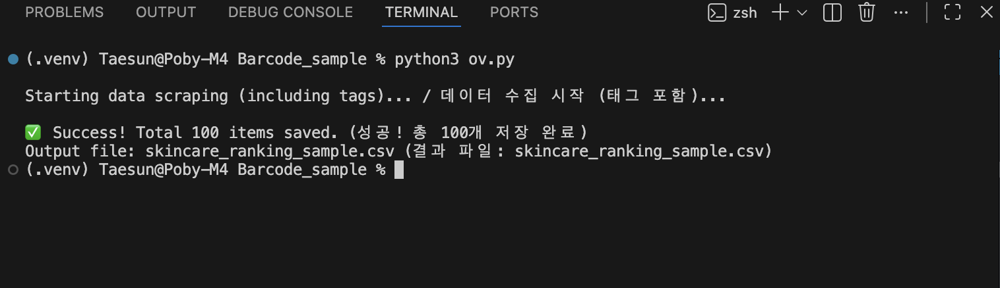

# High-Volume E-commerce Scraper (Olive Young)

> **"Scraping Korea's No.1 Health & Beauty Platform"**
> *(대한민국 1위 H&B 스토어 '올리브영' 스킨케어 랭킹 수집 봇)*

## Developer Profile (개발자 소개)
* **Native Korean Developer:** Based in Canada. (캐나다 거주 한국인 개발자)
* **Specialty:** Expert in scraping Korean platforms like **Naver, Coupang, and Olive Young**.
    * *(네이버, 쿠팡, 올리브영 등 한국 플랫폼 구조 분석 및 크롤링 전문가)*
* **Communication:** Fluent in English & Native in Korean.

---

## Project Overview
This project demonstrates a robust web scraper designed to extract real-time **Skincare Ranking** data from **Olive Young** (similar to **Sephora** or **Boots**).

* **Objective:** Extract Rankings, Brand Names, Prices, and Dynamic Promotion Tags (Sale, Coupon, etc.).
* **Target:** Specifically filtered for the **"Skincare"** category to identify high-value trends.
* **Challenge:** The site uses complex HTML structures and strict anti-bot measures.
* **Solution:** Implemented human-mimicking headers, random delays, and robust error handling.

---

## Visual Evidence (증거 자료)

### 1. Target Site (수집 대상)
> The script scrapes product data from this ranking page.

### 2. Execution Log (실행 로그)
> **Bilingual Output:** Supports both English and Korean logs for better collaboration.

---

## Tech Stack & Key Features
* **Language:** Python 3.x
* **Libraries:** `Requests`, `BeautifulSoup4`
* **Key Logic:**
    * ✅ **Anti-Bot Bypass:** Uses realistic `User-Agent` and random sleep timers.
    * ✅ **Dynamic Tag Parsing:** Captures variable tags like "Sale", "Coupon", "Best" securely.
    * ✅ **UTF-8 Encoding:** Perfect handling of Korean characters (Hangul).

---

## Security & Privacy Notice
To respect the target website's policies and NDA considerations:
1.  **Source Code:** Only the core logic structure is shared in `scraper.py`. Real URLs are masked.
2.  **Data:** The `skincare_ranking_sample.csv` demonstrates the clean data structure (English Headers), not confidential business data.

> *Check `scraper.py` to see the clean coding style and logic structure.*
